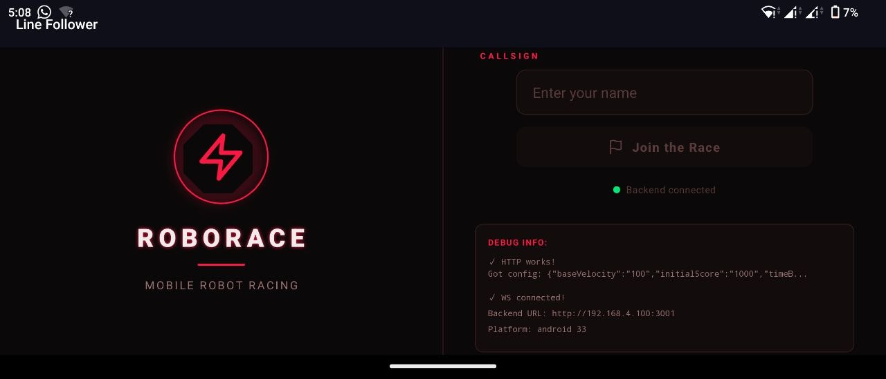
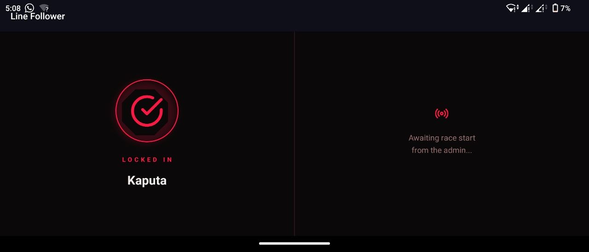
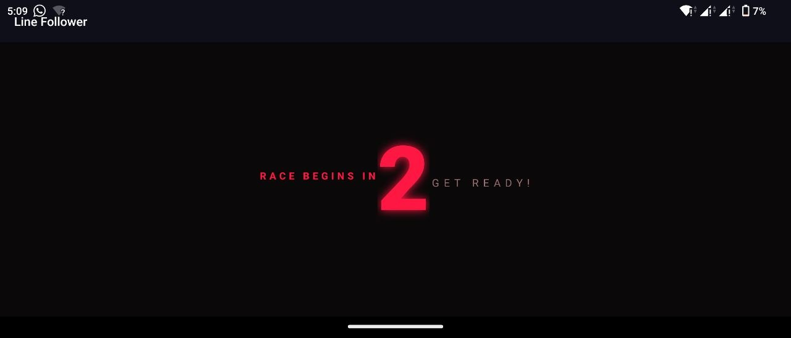
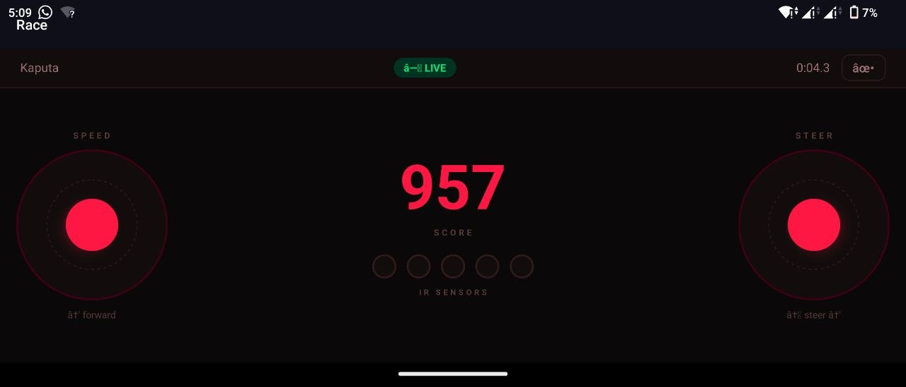
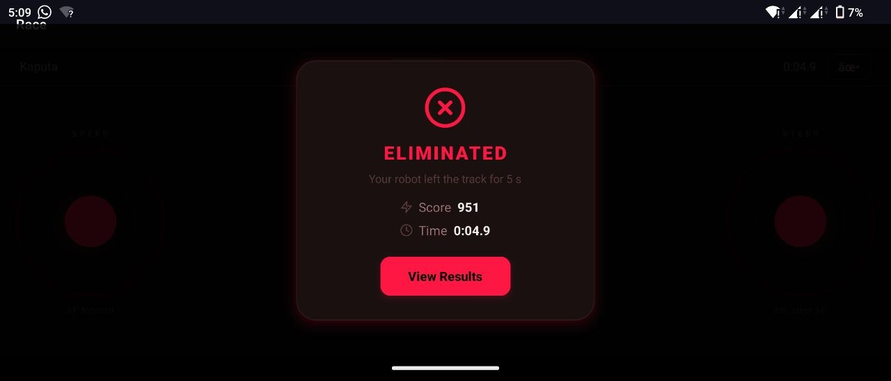

# 🤖 RoboRace — Mobile Robot Racing Challenge

<div align="center">


**A high-energy competitive robot racing game with real-time scoring, mobile joystick control, and live leaderboards.**

[Download APK](https://expo.dev/accounts/dewminawijekoons-organization/projects/mobile-robot-controller/builds/3ce0b9b9-5b74-455a-9e03-09ad0294efed) • [Hardware Setup](#-hardware-wiring) • [Quick Start](#-quick-start)

</div>

---

## 📱 Mobile App

<table>
  <tr>
    <td align="center">
      <br/>
      <sub><b>Start Screen</b></sub>
    </td>
    <td align="center">
      <br/>
      <sub><b>Admin Approval</b></sub>
    </td>
    <td align="center">
      <br/>
      <sub><b>Countdown</b></sub>
    </td>
    <td align="center">
      <br/>
      <sub><b>Racing and Live Score</b></sub>
    </td>
    <td align="center">
      <br/>
      <sub><b>Results</b></sub>
    </td>
  </tr>
</table>

**Download APK:** [Latest Release](https://expo.dev/accounts/dewminawijekoons-organization/projects/mobile-robot-controller/builds/3ce0b9b9-5b74-455a-9e03-09ad0294efed)

---

## 📋 Table of Contents

- [Repository Structure](#-repository-structure)
- [Game Rules](#-game-rules)
- [Network Architecture](#-network-architecture)
- [Hardware Wiring](#-hardware-wiring)
- [Quick Start](#-quick-start)
- [Race Day Setup](#-race-day-setup)
- [Admin Dashboard](#-admin-dashboard)
- [Configuration](#-configuration)
- [Testing](#-testing)

---

## 📁 Repository Structure

```
/firmware   — ESP32 C++ (PlatformIO + Arduino)
/mobile     — Expo React Native controller app (Android)
/backend    — Node.js + Express + SQLite REST & WebSocket server
/admin      — Vite + React admin dashboard
```

---

## 🎮 Game Rules

| Rule | Value |
|------|-------|
| **Initial Score** | 1000 points (configurable) |
| **Penalty** | −1 point per 100ms off line |
| **Elimination** | After 5 seconds cumulative off-line |
| **Time Bonus** | `max(0, 500 − floor(seconds) × 10)` |
| **Safety Kill** | Motors stop after 5s without commands |

---

## 🌐 Network Architecture

All devices connect to the **ESP32's WiFi Access Point** — no external WiFi needed.

```
┌─────────────────────────────────────────────────┐
│         ESP32 Access Point                      │
│   SSID: LineFollower    PASS: race1234          │
│            IP: 192.168.4.1                      │
└────────────┬────────────────────────┬───────────┘
             │                        │
    ┌────────▼────────┐      ┌────────▼────────┐
    │  Admin PC       │      │  Player Phones  │
    │  192.168.4.100  │      │  192.168.4.x    │
    ├─────────────────┤      ├─────────────────┤
    │ • Backend       │      │ • Mobile App    │
    │ • Dashboard     │      │ • WebSocket to  │
    │ • WebSocket     │      │   ESP32         │
    └─────────────────┘      └─────────────────┘
```

> ⚠️ **Important:** The admin PC needs a [static IP](#-race-day-setup) (`192.168.4.100`) so players can reach the backend consistently.

---

## ⚡ Hardware Wiring

### Motor Driver (L298N)

| Signal       | ESP32 GPIO |
|--------------|-----------|
| Left IN1     | 26        |
| Left IN2     | 27        |
| Left ENA/PWM | 18        |
| Right IN3    | 19        |
| Right IN4    | 21        |
| Right ENB/PWM| 22        |

> GPIO 16 & 17 are reserved for PSRAM on ESP32-WROOM — do not use for motors.

### IR Sensors (×5) — Digital DO Output

Connect each module's **DO pin** (not AO) to the ESP32. Use each module's blue trimmer pot to set the threshold: LED on = white line (DO = HIGH).

| Sensor | GPIO |
|--------|------|
| 1      | 32   |
| 2      | 33   |
| 3      | 34   |
| 4      | 35   |
| 5      | 4    |

### Finish Wall (HC-SR04 Ultrasonic)

| Signal | GPIO |
|--------|------|
| TRIG   | 23   |
| ECHO   | 25   |

The finish triggers when the robot is within **10 cm** of the wall (`FINISH_DISTANCE_CM` in `main.cpp`).

---

## 🚀 Quick Start

### 1️⃣ Flash the ESP32

```bash
cd firmware
pio run --target upload
pio device monitor   # 115200 baud — confirm "AP ready" message
```

Requires [PlatformIO](https://platformio.org/) (VS Code extension or CLI).

### 2️⃣ Start the Backend Server


```bash
cd backend
npm install

# Development (localhost, DEV_MODE available)
npm run dev

# Race day (binds to 0.0.0.0:3001)
npm run start
```

The server starts on `http://0.0.0.0:3001`.

### 3️⃣ Open the Admin Dashboard

```bash
cd admin
npm install

# Development (backend on localhost)
npm run dev

# Race day build (backend on 192.168.4.x)
# First update admin/.env.production with the PC's IP, then:
npm run build
npm run preview   # serves the production build locally
```

Open `http://localhost:5173` (dev) or `http://localhost:4173` (preview).

### 4️⃣ Install the Mobile App

**Option A: Download pre-built APK (recommended for race day)**

Download and install the latest APK on your Android device:
```
https://expo.dev/accounts/dewminawijekoons-organization/projects/mobile-robot-controller/builds/3ce0b9b9-5b74-455a-9e03-09ad0294efed
```

1. Open the link on your Android device
2. Download the APK
3. Install it (you may need to enable "Install from unknown sources")

**Option B: Build from source**

Requires a physical Android device with USB debugging enabled.

```bash
cd mobile
npm install
npx expo run:android   # builds and installs via expo-dev-client
```

For development with hot reload:
```bash
npx expo start --dev-client
```

Then open the Expo Dev Client app on the phone and connect.

---

## 🏁 Race Day Setup

### Set Static IP on Admin PC

The ESP32's DHCP server assigns different IPs. Set a static IP so the mobile app can reach the backend reliably.

**PowerShell (as Admin):**
```powershell
netsh interface ip set address name="WiFi" static 192.168.4.100 255.255.255.0 192.168.4.1
```

**Restore DHCP later:**
```powershell
netsh interface ip set address name="WiFi" dhcp
```

> `192.168.4.100` is pre-configured in `.env.production` files.

### Race Day Flow

1. Admin connects PC to `LineFollower` WiFi, starts backend (`npm run start`)
2. Admin opens dashboard (`http://localhost:5173` or the preview URL)
3. Player opens the app on their phone (phone connected to `LineFollower` WiFi)
4. Player enters their name → taps **Ready to Race**
   - App registers the player with the backend (POST `/api/race/start`)
   - App shows "Ready!" screen
5. Admin uses the **Race Control** tab to trigger a countdown (3 / 5 / 10 s)
   - App receives the countdown via WebSocket and shows an overlay
   - At zero, app connects to ESP32 and sends the `start` command
6. Player drives using the dual joysticks:
   - **Left joystick** (Y-axis) — throttle: push up = forward
   - **Right joystick** (X-axis) — steering: left/right
7. Race ends when:
   - Robot reaches the finish wall (ultrasonic trigger), or
   - Robot is off-line for 5 cumulative seconds (eliminated)
8. Results screen shows final score + time bonus
   - Result is automatically POSTed to the backend
   - Leaderboard on the admin dashboard updates live

---

## 🎛️ Admin Dashboard

| Tab | Purpose |
|-----|---------|
| **Leaderboard** | Live rankings, top 3 highlighted, clear button |
| **Config** | Base velocity (0–255), initial score, time bonus toggle; "Push to Robot" sends config directly to ESP32 |
| **Race Control** | Countdown broadcast, emergency stop |

### Push config to robot

The **Push to Robot** button opens a WebSocket directly to `ws://192.168.4.1/ws` and sends:
```json
{ "type": "config", "baseVelocity": 180, "initialScore": 1000 }
```
The PC must be connected to the `LineFollower` AP when doing this (it usually already is on race day).

---

## 🔧 Sensor Calibration

While the ESP32 is running, open a browser and visit:
```
http://192.168.4.1/calibrate
```
The Serial monitor will print all 5 sensor DO values (0 or 1) every 200 ms for 10 seconds. Adjust each module's trimmer pot until the correct sensors read `1` on white and `0` on black.

---

## ⚙️ Configuration

### Environment Files

| Component | Development | Production |
|-----------|-------------|------------|
| **Backend** | `.env.development` | `.env.production` |
| **Admin** | `.env.development` | `.env.production` |
| **Mobile** | `.env.development` | `.env.production` |

**Default backend URL:** `192.168.4.100:3001`

> 💡 **Tip:** Use `.env.local` or `.env.*.local` for machine-specific overrides (gitignored).

### Changing Network Configuration

If you need a different static IP than `192.168.4.100`, update:

- `admin/.env.production` → `VITE_BACKEND_BASE_URL` and `VITE_BACKEND_WS_URL`
- `mobile/.env.production` → `EXPO_PUBLIC_BACKEND_BASE_URL`

---

## ✅ Testing

- [ ] Full race: player drives to finish wall, time bonus awarded, leaderboard updates
- [ ] Elimination: robot off-line for 5 s, app shows elimination screen, result saved
- [ ] Config push: admin changes base velocity, pushes to robot, motor speed changes
- [ ] Leaderboard: multiple competitors ranked correctly (final score DESC, time ASC)
- [ ] No-signal kill: phone disconnects mid-race, motors stop within 5 s
- [ ] Admin countdown: 3-2-1 overlay appears on phone, race starts automatically
